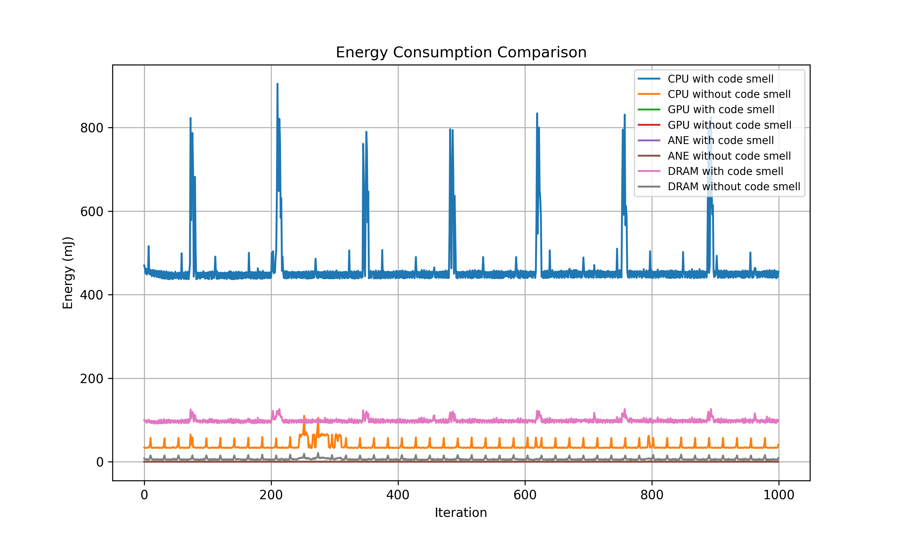

<p align="center">
  
</p>


[](https://github.com/fstormacq/EnergyTracer/actions/workflows/main.yaml)
[](https://creativecommons.org/licenses/by-nc-sa/4.0/)
[]()
[](https://python.org)
[](https://github.com/astral-sh/uv)


<!-- omit in toc -->
## Table of Contents
- [Description](#description)
- [Quick Start](#quick-start)
- [Installation](#installation)
- [Usage](#usage)
  - [Command-Line Options](#command-line-options)
  - [Outputs](#outputs)
- [Sample Results](#sample-results)
  - [Overall Energy Comparison](#overall-energy-comparison)
  - [Per-Component Comparisons](#per-component-comparisons)
  - [Box Plots (Moustache)](#box-plots-moustache)
- [Profilers](#profilers)
  - [Mac Silicon (Zeus)](#mac-silicon-zeus)
  - [CodeCarbon](#codecarbon)
- [Automated Measurement Script](#automated-measurement-script)
- [Acknowledgements](#acknowledgements)
- [License](#license)


## Description

Have you ever wondered how much energy your code consumes? How to optimize it for better energy efficiency? Or how it impacts the environment? EnergyTracer is here to help you answer these questions, and more! This tool allows you to measure the energy consumption of your code, compare different implementations, and even estimate the CO₂ emissions associated with running your code. Sounds great, right?


## Quick Start

```shell
# 1. Clone & init
git clone https://github.com/fstormacq/EnergyTracer.git && cd EnergyTracer
./init.sh          # or init.bat on Windows

# 2. Run with default settings
uv run ET

# 3. Run with Apple Silicon profiler, 500 iterations
uv run ET -p mac-silicon -n 500 --shuffle -v
```


## Installation

EnergyTracer requires Python and uses [`uv`](https://github.com/astral-sh/uv) to manage the environment and dependencies. Once you have `uv` installed, run:

```shell
# Initialize the project (install dependencies)
./init.sh
```

```bash
# For Windows users:
.\init.bat
```

The script sets up a dedicated virtual environment managed by `uv` and installs all necessary dependencies. After running it, you are ready to go.


## Usage

Run EnergyTracer with:

```shell
uv run EnergyTracer

# or simply
uv run ET
```

This executes the `EnergyTracer` entry point, which measures the energy consumption of the default code variants and plots the results.

Alternatively, you can run the module directly:

```shell
uv run -m src.main
```

### Command-Line Options

| Flag | Description | Default |
|---|---|---|
| `-h`, `--help` | Show the help message and exit | — |
| `-p`, `--profiler` | Energy profiler to use: `carbon` or `mac-silicon` | `carbon` |
| `-n`, `--iter` | Number of iterations for the code under measurement | `1000` |
| `-f1`, `--src-file-1` | Path to the source file **with** the code smell | `src/python/file_with_code_smell.py` |
| `-f2`, `--src-file-2` | Path to the source file **without** the code smell | `src/python/file_without_code_smell.py` |
| `-o`, `--output-dir` | Directory to save generated plots and CSV files | `output` |
| `--shuffle` | Randomize execution order of code variants to mitigate temporal effects | off |
| `-v`, `--verbose` | Enable verbose output during profiling | off |

Example:

```shell
# Compare two files for 500 iterations using the Zeus Apple Silicon profiler,
# with shuffling and verbose output
uv run ET -p mac-silicon -n 500 --shuffle -v
```

All generated data is saved in the `output/{profiler}/{output_dir}` directory, where `{profiler}` is the name of the profiler used (e.g., `mac-silicon` or `carbon`) and `{output_dir}` is the value of the `--output-dir` argument (default is `output`).

### Outputs

EnergyTracer generates two main types of outputs:

1. **Plots**: For each energy metric (CPU, GPU, ANE/gCO₂, DRAM), a plot is generated comparing the two code variants across iterations. These plots are saved as PNG files in the output directory. An overall comparison plot is also generated, showing all metrics together for a comprehensive view of energy consumption differences.
2. **CSV Files**: The raw energy data collected during the measurements is saved in CSV format for further analysis. Each row corresponds to an iteration, and columns include the iteration index and energy values for each metric (CPU, GPU, ANE/CO₂, DRAM). This allows you to perform your own custom analysis or create additional visualizations.


## Sample Results

Below are example outputs generated by EnergyTracer when comparing two code variants using the `mac-silicon` profiler on an Apple M1 Pro MacBook Pro. The two code variants are a simple database request: one without any limitation (the "code smell" variant) and one with a limit on the number of results returned (the "clean" variant). The measurements were taken over 1000 iterations for each variant and are extracted from a series of 30 measurement phases. See [Automated Measurement Script](#automated-measurement-script) for details on the measurement process.

### Overall Energy Comparison

<p align="center">
  
</p>

### Per-Component Comparisons

| CPU | GPU |
|:---:|:---:|
|  |  |
| ANE | DRAM |
|  |  |

As the code under measurement is a simple but heavy database request, the CPU and the DRAM (i.e., RAM) are the most impacted components, while the GPU and the ANE are barely affected (excluding noise). The "code smell" variant (without the limit) consumes significantly more energy than the "clean" variant, which is expected since it processes more data and performs more work. Moreover, peaks can be observed in the CPU and DRAM energy consumption for the "code smell" variant, likely due to Python's internal memory management and garbage collection. This shows that energy consumption can be affected not only by the amount of work performed but also by how resources such as memory are managed.

### Box Plots (Moustache)

> Coming soon...


## Profilers

EnergyTracer supports various profilers to collect energy metrics. Here is a summary of the supported profilers:

| Profiler | Library | Method | Hardware | Precision (out of 3) | Best for |
|---|---|---|---|:---:|---|
| `mac-silicon` | `zeus_apple_silicon` | Reads Apple Silicon **hardware power counters** directly (IOKit) | **Apple M-series only** | ⭐⭐⭐ | Accurate absolute energy measurement on M-series Macs; fine-grained profiling of code blocks |
| `carbon` | `codecarbon` | **Software model**: estimates power from CPU TDP, utilization, and time | **Cross-platform** | ⭐⭐ | CO₂ emission reports; long-running workloads; multi-platform projects or mixed hardware |

> **Note on measurement differences:** The different profilers will report different values for the exact same workload. This is expected because they use fundamentally different measurement methods.
>
> **Further improvements:** In the future, support for additional profilers may be added. The modular design of EnergyTracer allows for easy integration of new measurement backends.

### Mac Silicon (Zeus)

The `mac-silicon` profiler reads energy data directly from Apple Silicon hardware counters via IOKit, Apple's private kernel framework. This gives sub-millisecond, per-component accuracy without requiring `sudo` or any background daemon.

The following metrics are collected over time:

- **CPU**: energy consumed by all CPU clusters (E-cores and P-cores)
- **GPU**: energy consumed by the integrated GPU
- **ANE**: energy consumed by the Apple Neural Engine
- **DRAM**: energy consumed by unified memory

All metrics are measured in millijoules (mJ).

### CodeCarbon

The `carbon` profiler uses a software estimation model: it samples CPU utilization and maps it against the processor's thermal design power (TDP) to estimate electricity consumption, then converts it to CO₂ equivalent using the carbon intensity of your region.

The following metrics are collected over time:

- **CPU**: estimated energy from CPU TDP and utilization
- **GPU**: estimated energy from GPU utilization (if supported)
- **DRAM**: estimated energy based on memory usage
- **gCO₂**: estimated CO₂ emissions based on energy consumption and regional carbon intensity. This measure replaces the `ANE` metric since CodeCarbon does not have access to the Apple Neural Engine's energy data.

All energy metrics are estimated in millijoules (mJ), and CO₂ emissions are estimated in milligrams of CO₂ equivalent (mgCO₂e).


## Automated Measurement Script

To facilitate repeated measurements and comparisons, a shell script named `run_experiment.sh` is provided. This script automates running the measurements with multiple phases (warm-up, measurement, cooldown) and ensures consistent parameters across runs.

```shell
./run_experiment.sh
```

```shell
# For Windows users:
.\run_experiment.bat
```

The script performs the following steps:

1. **Warm-up phases**: Runs 10 iterations of all profilers to stabilize the system and mitigate initial variability in measurements.
2. **Measurement phases**: Runs 30 iterations of measurements for each profiler, with 1000 iterations of the code under test in each phase.
3. **Cooldown periods**: Includes a one-minute cooldown between measurement phases to allow the system to return to baseline conditions and minimize thermal effects.

To further reduce temporal bias, the execution order of code variants is randomized in each iteration using the `--shuffle` flag. The script also provides a terminal progress bar to indicate the current phase and iteration.

> **Important note on reproducibility**: The results of energy measurements can be affected by various factors such as background processes, thermal conditions, and network activity. To ensure reproducible measurements, it is recommended to set up your system in a consistent state beforehand. For more details, refer to this [guide](https://luiscruz.github.io/2021/10/10/scientific-guide.html) on best practices for reproducible energy measurements.
>
> It is advisable to avoid using the system for any other tasks while the script runs, to minimize interference with the measurements.


## Acknowledgements

This project was developed as part of a Master's degree in Computer Science at the University of Namur, Belgium.


## License

This project is licensed under the [Creative Commons Attribution-NonCommercial-ShareAlike 4.0 International License](https://creativecommons.org/licenses/by-nc-sa/4.0/).

© 2026 Florian Stormacq. You are free to use, share, and adapt this work for non-commercial purposes, as long as you give appropriate credit and distribute your contributions under the same license.
