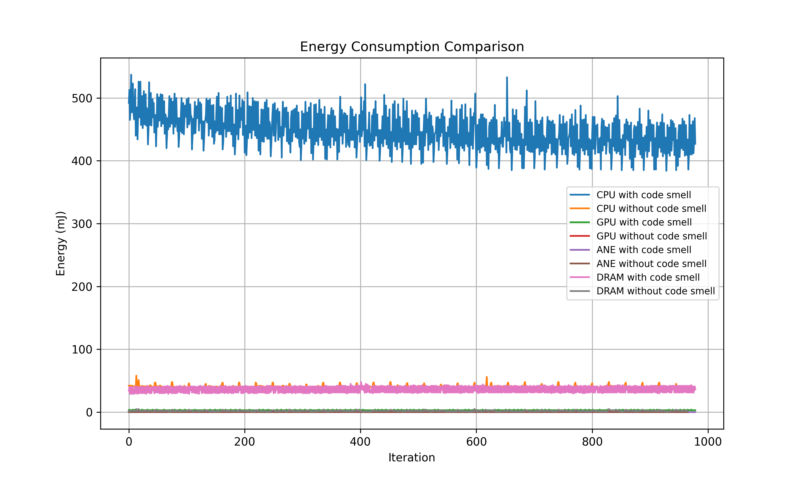
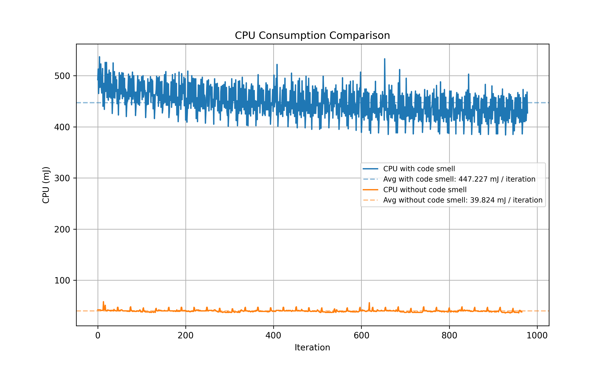
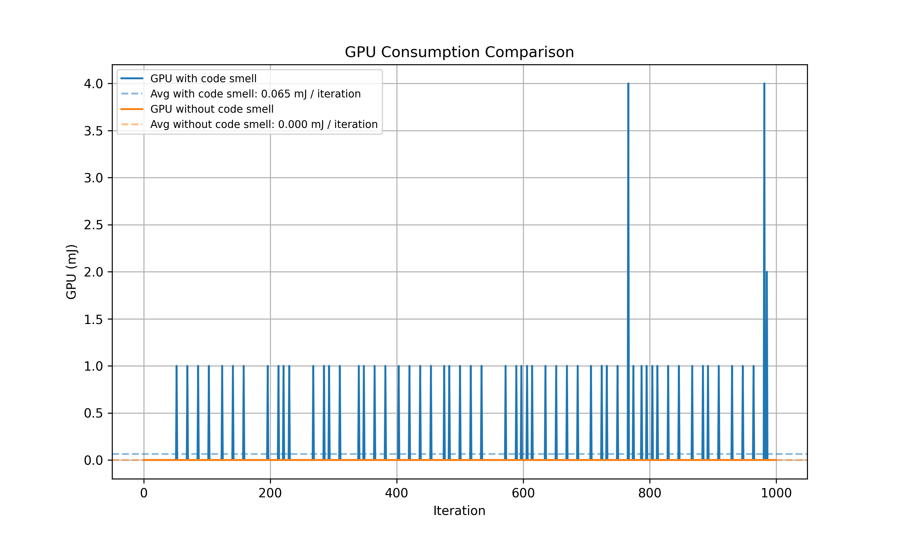
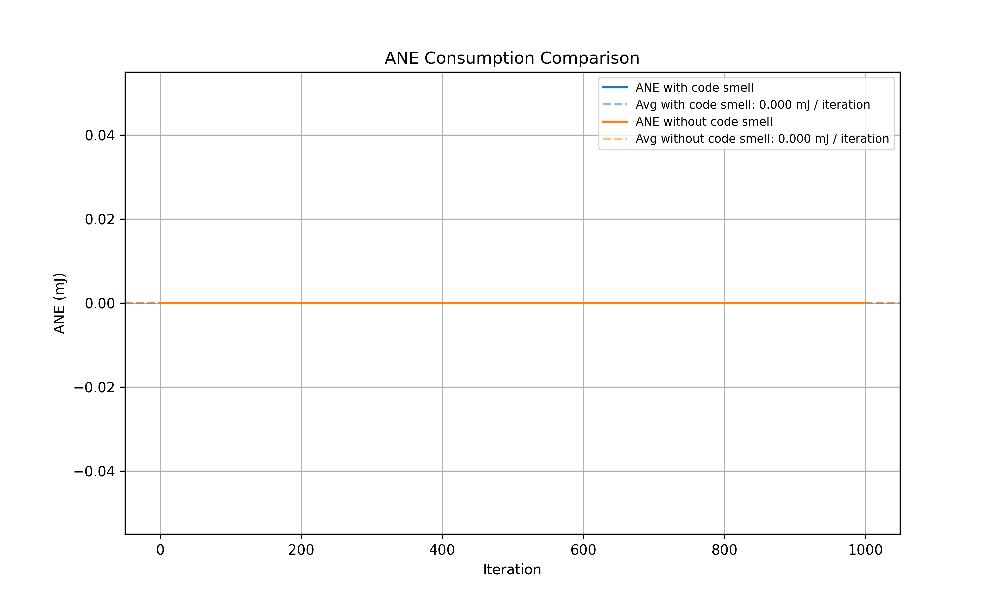
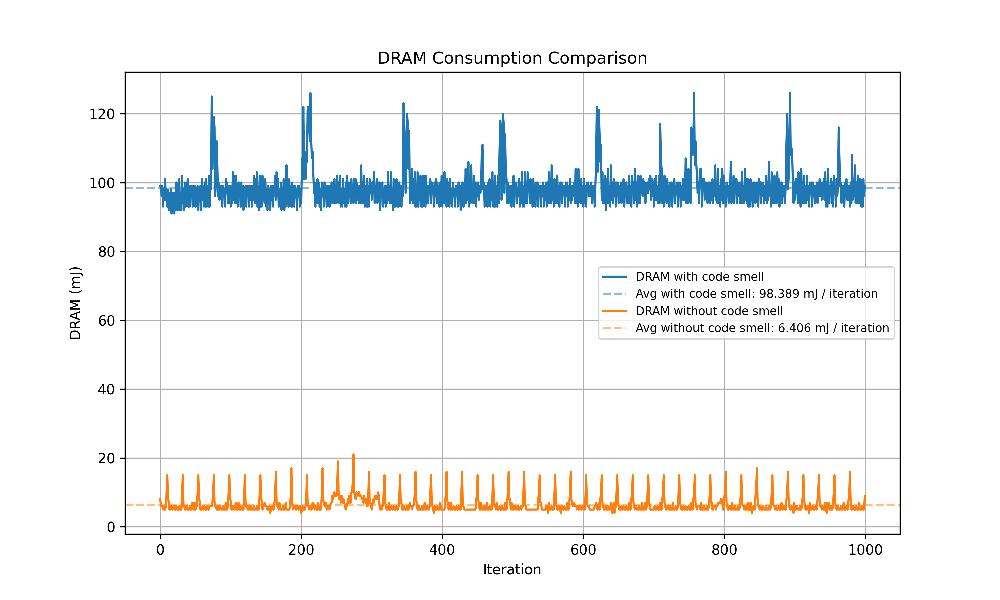
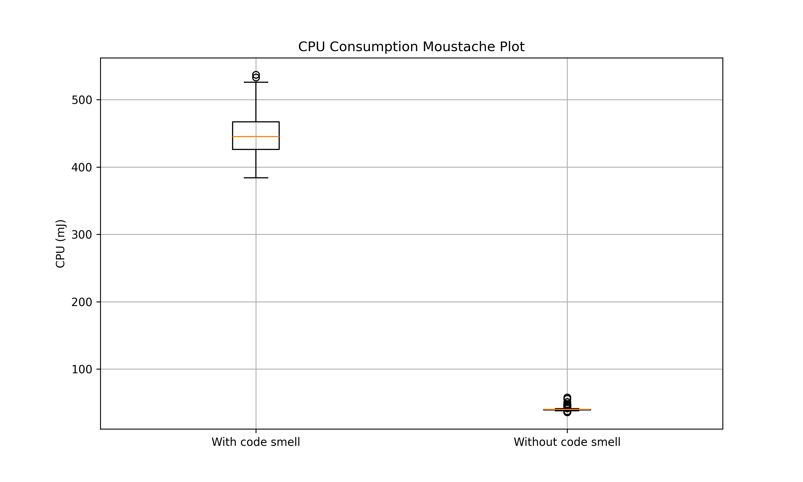
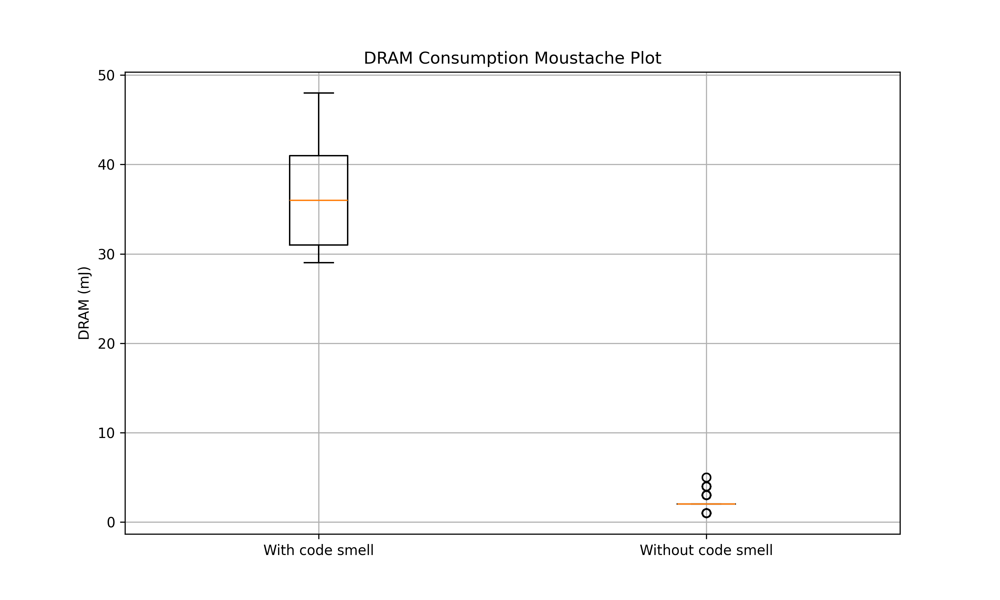
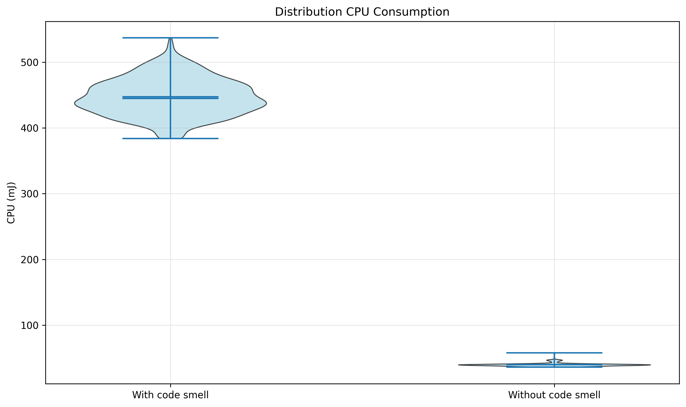
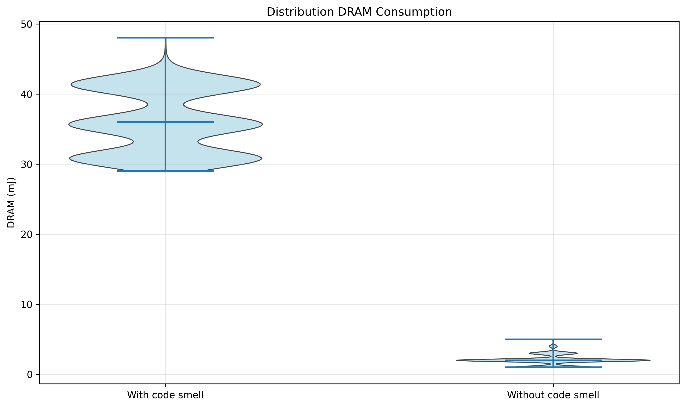

<p align="center">
  
</p>


[](https://github.com/fstormacq/EnergyTracer/actions/workflows/main.yaml)
[](LICENSE)
[]()
[](https://python.org)
[](https://github.com/astral-sh/uv)


<!-- omit in toc -->
## Table of Contents
- [Description](#description)
- [Quick Start](#quick-start)
- [Installation](#installation)
- [Usage](#usage)
  - [Command-Line Options](#command-line-options)
  - [Supported Languages](#supported-languages)
  - [Outputs](#outputs)
- [Sample Results](#sample-results)
  - [Overall Energy Comparison](#overall-energy-comparison)
  - [Per-Component Comparisons](#per-component-comparisons)
  - [Box Plots \& Violin Plots](#box-plots--violin-plots)
- [Profilers](#profilers)
  - [Measurement Methodology \& Limitations](#measurement-methodology--limitations)
  - [Mac Silicon (Zeus)](#mac-silicon-zeus)
  - [CodeCarbon](#codecarbon)
- [Analyzer (ET-analyzer)](#analyzer-et-analyzer)
  - [Analyzer Command-Line Options](#analyzer-command-line-options)
  - [Sample Report Output](#sample-report-output)
- [Automated Measurement Script](#automated-measurement-script)
- [Experiment Guide](#experiment-guide)
- [Author](#author)
- [Acknowledgements](#acknowledgements)
- [License](#license)


## Description

Have you ever wondered how much energy your code consumes? How to optimize it for better energy efficiency? Or how it impacts the environment? EnergyTracer is here to help you answer these questions, and more! This tool allows you to measure the energy consumption of your code, compare different implementations, and even estimate the CO₂ emissions associated with running your code. It provides comprehensive insights into code energy efficiency.

EnergyTracer supports multiple source languages through an extensible runner architecture. Language detection is automatic from file extension, and the same measurement pipeline can profile both interpreted and compiled code.


## Quick Start

```shell
# 1. Clone & init
git clone https://github.com/fstormacq/EnergyTracer.git && cd EnergyTracer
./init.sh          # or init.bat on Windows

# 2. Run with default settings
uv run ET

# (Optional) Run with Apple Silicon profiler, 500 iterations
uv run ET -p mac -n 500 --shuffle -v

# 3. Run the analyzer to generate a Markdown report
uv run ET-analyzer -v

# (Optional) Run the full experiment script (30 measurement phases with cooldowns)
./run_experiment.sh carbon
```


## Installation

EnergyTracer requires Python and uses [`uv`](https://github.com/astral-sh/uv) to manage the environment and dependencies. Once you have `uv` installed, run:

```shell
# Initialize the project (install dependencies)
./init.sh
```

```bash
# For Windows users:
.\init.bat
```

The script sets up a dedicated virtual environment managed by `uv` and installs all necessary dependencies. After running it, you are ready to go.


## Usage

Run EnergyTracer with:

```shell
uv run EnergyTracer

# or simply
uv run ET
```

This executes the `EnergyTracer` entry point, which measures the energy consumption of the default code variants and plots the results.

Alternatively, you can run the module directly:

```shell
uv run -m src.main
```

### Command-Line Options

| Flag | Description | Default |
|---|---|---|
| `-h`, `--help` | Show the help message and exit | - |
| `-p`, `--profiler` | Energy profiler to use | `carbon` |
| `-n`, `--iter` | Number of iterations for the code under measurement | `1000` |
| `-f1`, `--src-file-1` | Path to the source file **with** the code smell | `src/examples/python/code_with_smell.java` |
| `-f2`, `--src-file-2` | Path to the source file **without** the code smell | `src/examples/python/code_without_smell.java` |
| `-o`, `--output-dir` | Directory to save generated plots and CSV files | `output` |
| `--shuffle` | Randomize execution order of code variants to mitigate temporal effects | off |
| `-v`, `--verbose` | Enable verbose output during profiling | off |

### Supported Languages

EnergyTracer automatically detects the language of `--src-file-1` and `--src-file-2` from file extension and selects the matching runner implementation. The two input files must use the same language for a single measurement run.

Currently supported languages:

- **Python** (`.py`)
- **Java** (`.java`)

Under the hood, each language runner follows the same lifecycle:

1. **`prepare`**: one-time setup before the measurement loop
2. **`run_prepared`**: one execution per measured iteration
3. **`cleanup`**: resource teardown after the loop

This design avoids redundant setup work and improves fairness across iterations. For compiled languages, compilation happens once in `prepare`, then the compiled artifact is executed `N` times in `run_prepared`.

To add a new language, implement the `CodeRunner` interface (`prepare` / `run_prepared` / `cleanup`) and register the file extension in `src/runners/detect.py`.

**Usage example**:

```shell
# Compare two files for 500 iterations using the Mac Silicon profiler,
# with shuffling and verbose output
uv run ET -p mac -n 500 --shuffle -v
```

All generated data is saved in the `output/{profiler}/{output_dir}` directory, where `{profiler}` is the name of the profiler used (e.g., `mac` or `carbon`) and `{output_dir}` is the value of the `--output-dir` argument (default is `output`).

### Outputs

EnergyTracer generates two main types of outputs:

1. **Plots**: For each energy metric (CPU, GPU, ANE/gCO₂, DRAM), a plot is generated comparing the two code variants across iterations. These plots are saved as PNG files in the output directory. An overall comparison plot is also generated, showing all metrics together for a comprehensive view of energy consumption differences.
2. **CSV Files**: The raw energy data collected during the measurements is saved in CSV format for further analysis. Each row corresponds to an iteration, and columns include the iteration index and energy values for each metric (CPU, GPU, ANE/CO₂, DRAM). This allows you to perform your own custom analysis or create additional visualizations.


## Sample Results

Below are example outputs generated by EnergyTracer when comparing two code variants using the `mac` profiler on an Apple M4 Mac mini via SSH. The two code variants perform a simple database request: one without any limitation (the "code smell" variant) and one with a limit on the number of results returned (the "clean" variant). The measurements were taken over 1000 iterations for each variant and are extracted from a series of 30 measurement phases. See [Automated Measurement Script](#automated-measurement-script) for details on the measurement process.

### Overall Energy Comparison

<p align="center">
  
</p>

### Per-Component Comparisons

| CPU | GPU |
|:---:|:---:|
|  |  |
| ANE | DRAM |
|  |  |

Since the code under measurement performs a simple but heavy database request, the CPU and the DRAM (i.e., RAM) are the most impacted components, while the GPU and the ANE are barely affected (excluding noise). The "code smell" variant (without the limit) consumes significantly more energy than the "clean" variant, which is expected since it processes more data and performs more work. 

### Box Plots & Violin Plots

As this experiment includes 30 measurement phases, we can also visualize the distribution of energy values across all iterations using box plots (also known as moustache plots). Below are the two box plots for the CPU energy metric, comparing the "code smell" and "clean" variants:

| CPU | DRAM |
|:---:|:---:|
|  |  |

Finally, we can also visualize the distribution using violin plots, which show the kernel density estimation of the data:

| CPU | DRAM |
|:---:|:---:|
|  |  |

All these plots were generated using the cleaned output from a set of 30 measurement phases. The analysis removed outliers and normalized the data to mitigate temporal effects. To reproduce similar results, it is recommended to follow the full experiment protocol described in the [Experiment Guide](#experiment-guide) and to run a sufficient number of measurement phases (at least 30) to ensure statistical significance.

## Profilers

EnergyTracer supports various profilers to collect energy metrics. Here is a summary of the supported profilers:

| Profiler | Library | Method | Hardware | Precision (out of 3) | Best for |
|---|---|---|---|:---:|---|
| `mac` | `zeus_apple_silicon` | Reads Apple Silicon **hardware power counters** directly (IOKit) | **Apple M-series only** | ⭐⭐⭐ | Accurate absolute energy measurement on M-series Macs; fine-grained profiling of code blocks |
| `carbon` | `codecarbon` | **Software model**: estimates power from CPU TDP, utilization, and time | **Cross-platform** | ⭐⭐ | CO₂ emission reports; long-running workloads; multi-platform projects or mixed hardware |

### Measurement Methodology & Limitations

EnergyTracer compares two source variants by repeating the same execution path across many iterations. The runner lifecycle (`prepare` once, `run_prepared` many times) reduces measurement noise caused by repeated setup.

That said, absolute values are still influenced by language runtime behavior:

- **Python**: code runs in-process via `exec`, with no subprocess startup overhead per iteration.
- **Java**: each iteration launches a JVM process, which introduces startup overhead (commonly around ~100-400 ms depending on machine and environment).
- **Other compiled languages (e.g., Rust, Go)**: once supported, they will also execute via external process launches, typically with lower startup overhead than a full JVM.

As a consequence, **cross-language absolute comparisons can be biased by runtime startup costs**.

However, **same-language comparisons remain valid** (e.g., Java smell vs Java no-smell, Python smell vs Python no-smell), because runtime startup overhead is effectively constant within a language pair and cancels out in relative differences.

> **Note on measurement differences:** The different profilers will report different values for the exact same workload. This is expected because they use fundamentally different measurement methods.
>
> **Further improvements:** In the future, support for additional profilers may be added. The modular design of EnergyTracer allows for easy integration of new measurement backends.

### Mac Silicon (Zeus)

The `mac` profiler reads energy data directly from Apple Silicon hardware counters via IOKit, Apple's private kernel framework. This provides sub-millisecond, per-component accuracy without requiring `sudo` or any background daemon.

The following metrics are collected over time:

- **CPU**: energy consumed by all CPU clusters (E-cores and P-cores)
- **GPU**: energy consumed by the integrated GPU
- **ANE**: energy consumed by the Apple Neural Engine
- **DRAM**: energy consumed by unified memory

All metrics are measured in millijoules (mJ).

### CodeCarbon

The `carbon` profiler uses a software estimation model: it samples CPU utilization and maps it against the processor's thermal design power (TDP) to estimate electricity consumption, then converts it to CO₂ equivalent using the carbon intensity of your region.

The following metrics are collected over time:

- **CPU**: estimated energy from CPU TDP and utilization
- **GPU**: estimated energy from GPU utilization (if supported)
- **DRAM**: estimated energy based on memory usage
- **gCO₂**: estimated CO₂ emissions based on energy consumption and regional carbon intensity. This measure replaces the `ANE` metric since CodeCarbon does not have access to the Apple Neural Engine's energy data.

All energy metrics are estimated in millijoules (mJ), and CO₂ emissions are estimated in milligrams of CO₂ equivalent (mgCO₂e).

## Analyzer (ET-analyzer)

After collecting measurements with `ET`, use the **analyzer** to aggregate all runs, compute statistical tests, and produce a PR-ready Markdown report.

```shell
# Analyze all CSV files under the default output/ directory
uv run ET-analyzer -v

# Analyze a custom directory
uv run ET-analyzer -p path/to/output -v
```

The analyzer:

1. **Discovers** all CSV files under the input directory and classifies them by profiler, data type (raw / cleaned), and variant (with / without smell).
2. **Merges** per-group CSVs into a single file per group and saves them under `results/`.
3. **Generates a Markdown report** for each profiler / data-type pair with:
   - A results table showing **only statistically significant** metrics (Welch's t-test, α = 0.05)
   - Cohen's d effect size for each metric
   - A verdict section summarizing the energy impact

The report is designed to be directly copy-pasted into a GitHub Pull Request description.

### Analyzer Command-Line Options

| Flag | Description | Default |
|---|---|---|
| `-p`, `--path` | Input directory containing the CSV output | `output` |
| `-v`, `--verbose` | Enable verbose output | off |

### Sample Report Output

```md
## Energy Report - `mac` (cleaned)

> 993 samples (with smell) vs 996 samples (without smell) - α = 0.05

### Instance Info

* **hostname**: `MBP-M1P`
* **model**: `MacBookPro18,3`
* **os**: `Darwin 25.3.0`
* **machine**: `arm64`
* **chip**: `Apple M1 Pro`

### Global Consumption

|  | With smell | Without smell |
|---|---:|---:|
| **Execution Time** | 42.04 ms | 41.42 ms |
| **Average Power** | 5.806 W | 5.548 W |
| **Total Energy** | 242.36 J | 228.89 J |

> The total energy is the sum of measurements across all iterations, converted to joules (J). If you ran the `./run_experiment.sh` script, this reflects the cumulative energy of all 30 iterations of the process.

### Statistical Analysis

| Metric | Δ mean | p-value | Cohen’s d | Effect | Sig. |
|---|---|---|---|---|---|
| `cpu_mj` | +4.03% | 0.00e+00 | +5.483 | large | ✅ |
| `dram_mj` | +6.96% | 0.00e+00 | +9.544 | large | ✅ |
| `time_s` | +0.35% | 6.68e-25 | +0.474 | small | ✅ |

### Verdict

Removing the code smell leads to measurable energy differences:

- **`cpu_mj`**: 4.0% lower energy (Cohen’s d = +5.483, large)
- **`dram_mj`**: 7.0% lower energy (Cohen’s d = +9.544, large)
- **`time_s`**: 0.4% lower time (Cohen’s d = +0.474, small)

> Δ mean = (mean\_with − mean\_without) / mean\_with × 100. Positive → the smell consumes more energy.
```

> The automated experiment scripts (`run_experiment.sh` / `run_experiment.bat`) automatically run the analyzer after the measurement phase.

## Automated Measurement Script

To facilitate repeated measurements and comparisons, shell and batch scripts are provided. They automate running the measurements with multiple phases (warm-up, measurement, cooldown) and ensure consistent parameters across runs.

**`run_experiment.sh`** (macOS / Linux) takes a **mode** argument:

| Mode | Profilers run | Use case |
|---|---|---|
| `carbon` | `carbon` only | Any platform (cross-platform) |
| `mac` | `mac` only (zeus_apple_silicon) | Apple Silicon machines |
| `both` | `carbon` + `mac` | Apple Silicon - cross-profiler comparison |

```shell
./run_experiment.sh carbon   # Any platform: runs CodeCarbon only
./run_experiment.sh mac      # Apple Silicon: runs mac profiler only
./run_experiment.sh both     # Apple Silicon: runs both profilers
```

**`run_experiment.bat`** (Windows) runs CodeCarbon only - no argument needed:

```bat
run_experiment.bat
```

When `both` mode is selected, each iteration runs **two profilers** (`carbon` + `mac`), facilitating cross-profiler comparison. In `carbon` or `mac` mode (or on Windows), only the selected profiler is used.

The script performs the following steps:

1. **Warm-up phases**: Runs 10 iterations of all profilers to stabilize the system and mitigate initial variability in measurements.
2. **Measurement phases**: Runs 30 iterations of measurements for each profiler, with 1000 iterations of the code under test in each phase.
3. **Cooldown periods**: Includes a one-minute cooldown between measurement phases to allow the system to return to baseline conditions and minimize thermal effects.
4. **Analysis**: Runs `ET-analyzer` to merge all CSV files, compute statistical tests (Welch's t-test, Cohen's d), and generate Markdown reports under `results/`.

To further reduce temporal bias, the execution order of code variants is randomized in each iteration using the `--shuffle` flag. The script also provides a terminal progress bar to indicate the current phase and iteration.

> **Important note on reproducibility**: The results of energy measurements can be affected by various factors such as background processes, thermal conditions, and network activity. To ensure reproducible measurements, it is recommended to set up your system in a consistent state beforehand. See the [Experiment Guide](#experiment-guide) below for a complete checklist.


## Experiment Guide

Running reliable energy experiments requires a **controlled environment**. The full protocol - from machine preparation to statistical validation of results - is described in the dedicated [Experiment Guide](EXPERIMENT_GUIDE.md).

Here is a quick summary of the key steps:

1. **Prepare the environment** - close all non-essential apps, disconnect peripherals, plug in the charger, lock display/power settings, and ensure stable room temperature.
2. **Run the automated script** - `./run_experiment.sh both` (Apple Silicon, both profilers), `./run_experiment.sh mac` (Apple Silicon, mac only), or `./run_experiment.sh carbon` (any platform). The script handles warm-up, 30 measurement runs with cooldowns, shuffled execution order, and automated analysis.
3. **Do not interact** with the machine while the experiment is running.
4. **Review the results** - inspect the generated reports under `results/`, the comparison plots, and CSV files.

For a printable checklist and detailed explanations of each step, refer to the [full guide](EXPERIMENT_GUIDE.md).


## Author

EnergyTracer is authored and maintained by [Florian Stormacq](https://github.com/fstormacq)


## Acknowledgements

This project was developed as part of a Master's degree in Computer Science at the University of Namur, Belgium.


## License

This project is licensed under the [MIT License](LICENSE).

© 2026 Florian Stormacq. You are free to use, copy, modify, merge, publish, distribute, sublicense, and/or sell copies of this software under the terms of the MIT License.
